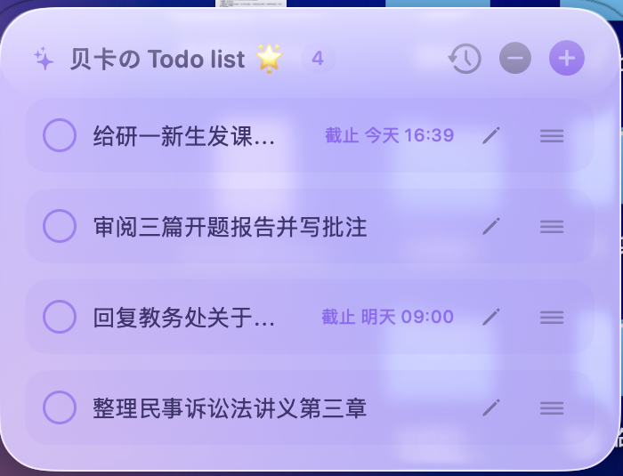
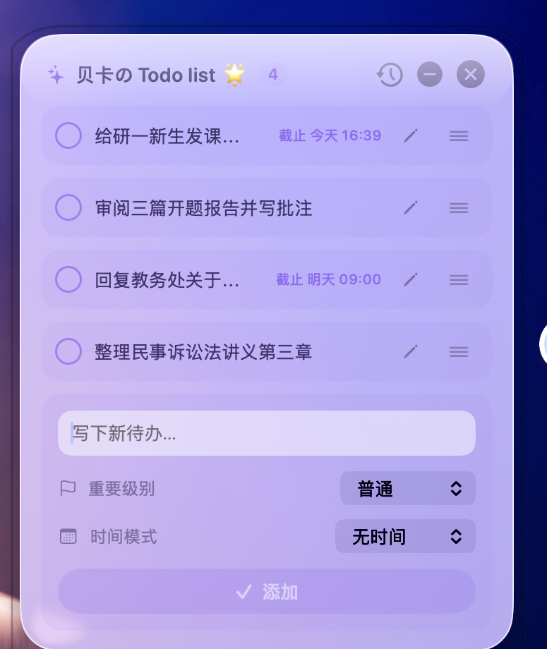

# 贝卡の Todo list 🌟

<p align="center">
  <strong>一款离线、本地优先的 macOS 桌面待办悬浮组件。</strong><br>
  用原生 SwiftUI + AppKit 制作，轻量常驻，收起后就是一个可拖动、会吸附边缘的紫色「干」圆球。
</p>

<p align="center">
  
</p>

## 功能一览

| | |
|---|---|
| **创建、编辑、拖动排序** | 新建或编辑时可完整修改标题、时间与重要级别；重要和紧急事项自动置顶。 |
| **时间与提醒** | 支持截止日期、某一天、期间；可选择到时提醒、提前一天（默认 21:00）或期间内每日提醒。 |
| **完成历史** | 完成后可在短暂撤销窗口内恢复；历史面板支持恢复、删除和清空。 |
| **悬浮球** | 点击减号收起为紫色液态玻璃「干」圆球；可拖动，并自动吸附到屏幕左/右边缘。 |
| **原生桌面体验** | 支持菜单栏、开机启动、桌面展示模式、深浅色外观，以及全屏应用场景下的中文输入法。 |
| **本地优先** | 不需要账号、不联网；待办只保存在你的 Mac。 |

<p align="center">
  
  
</p>

## 下载与安装

前往 [Releases](../../releases/latest) 下载 `LiquidTodo-macOS-universal.zip`：

1. 解压 ZIP；
2. 将 `LiquidTodo.app` 拖入“应用程序”；
3. 双击运行。首次从 GitHub 下载的版本如被 macOS 拦截，在 App 上**右键 → 打开**即可。

## 系统要求

- macOS 14 或更新版本
- Apple Silicon 和 Intel Mac（Universal Binary）
- 在 macOS 26 可使用系统 Liquid Glass；较旧系统会自动使用半透明材质回退效果

## 隐私与数据

- 应用不收集数据、不上传待办、不含分析或广告 SDK。
- 本地数据保存在：`~/Library/Application Support/LiquidTodo/data.json`
- 本仓库不包含任何个人待办、备份、开发环境文件或本机路径。

## 从源码构建

```bash
git clone https://github.com/lyyrebecca/beka-todo-list.git
cd beka-todo-list
./test.sh
./build.sh
open LiquidTodo.app
```

`build.sh` 生成经过 ad-hoc 签名的 Universal `LiquidTodo.app`。发布包会额外提供 SHA-256 校验文件。

## 开源协议

[MIT](LICENSE)
