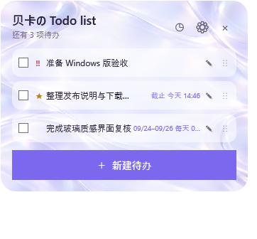

# 贝卡の Todo list 🌟

<p align="center"></p>

<p align="center"><strong>离线、本地优先的 Mac / Windows 桌面待办。</strong><br>收起后是可拖动、自动贴边的紫色「干」悬浮球。</p>

<p align="center"> </p>
<p align="center"><sub>左：macOS · 右：Windows x64；Windows 图由 GitHub Windows runner 实际渲染，使用演示数据</sub></p>

## 选哪个下载？

| 你的电脑 | 下载文件 | 适合谁 | 打开方式 |
|---|---|---|---|
| **Mac（Intel 或 Apple 芯片）** | `LiquidTodo-macOS-universal-v2.0.1.zip` | 所有 Mac 用户 | 解压后把 `LiquidTodo.app` 拖进“应用程序”，双击打开。 |
| **Windows 10 22H2 / Windows 11 x64** | `LiquidTodo-Windows-x64-Setup-v2.0.1.exe` | 推荐，大多数 Windows 用户 | 双击安装器，按提示安装；可选桌面快捷方式与开机启动。 |
| **Windows 10 22H2 / Windows 11 x64** | `LiquidTodo-Windows-x64-Portable-v2.0.1.zip` | 不想安装、想放 U 盘 | 解压整个文件夹，双击 `LiquidTodo.exe`；首次启动会在同级创建 `Data/`，之后不要删除它。 |

> **Windows 版无需安装 .NET。** 若 SmartScreen 显示“未知发布者”，点击 **更多信息 → 仍要运行**；这是因为目前尚未使用 Authenticode 证书。只从 [Releases](../../releases/latest) 下载，并用 `SHA256SUMS.txt` 核对文件。

## 三步开始使用

1. 下载上表中与你的系统对应的文件并打开应用。
2. 第一次启动会询问名称：可用默认“贝卡”，也可填写“小王”，标题即显示为“小王の Todo list”。之后随时点标题栏 **⚙** 修改。
3. 点 **＋** 新建待办；可设普通 / 重要 / 紧急、截止日期 / 某一天 / 期间，以及到时、前一天 21:00、期间每日提醒。

### 日常操作

- **编辑**：点击待办文字；标题、级别、日期、时间和提醒均可修改。
- **排序**：拖动每条最右侧的 `⋮⋮` 手柄；重要 / 紧急项目创建后自动置顶。
- **收起**：点 `−` 变为紫色「干」圆球，拖到屏幕边缘会自动吸附；点击圆球恢复。
- **完成**：勾选后有 4 秒撤销窗口；完成历史可恢复或清空。
- **备份**：托盘菜单中选择“导出备份 / 导入备份”。导入默认安全合并，按 UUID 去重，导入前自动备份本机数据。

## 功能

| 能力 | macOS | Windows x64 |
|---|---:|---:|
| 创建、完整编辑、拖动排序、三级重要度 | ✅ | ✅ |
| 截止日期、某一天、期间与提醒 | ✅ | ✅ |
| 完成、4 秒撤销、历史恢复 | ✅ | ✅ |
| 中文输入法、悬浮球、托盘、开机启动 | ✅ | ✅ |
| 自定义 `xxの Todo list` 名称 | ✅ | ✅ |
| 跨平台 JSON 导入 / 导出 | ✅ | ✅ |

## 数据与隐私

完全离线：无账号、遥测、广告、云同步或自动更新。

- **Mac**：`~/Library/Application Support/LiquidTodo/`
- **Windows 安装版**：`%LOCALAPPDATA%\LiquidTodo\`
- **Windows 便携版**：应用同级 `Data/`

备份格式为 [LiquidTodo Backup v1](shared/backup-schema/liquidtodo-backup-v1.schema.json)，可在 Mac 和 Windows 间手动迁移。

常规用户请从 [GitHub Releases](../../releases/latest) 选择上表对应的安装包。GitHub Packages 中的 `ghcr.io/lyyrebecca/beka-todo-list` 是下载文件镜像，包含 macOS ZIP、Windows Setup EXE、Windows Portable ZIP 和 SHA-256 清单，供偏好容器仓库的用户下载；不需要 Docker 的用户无需使用它。

## 开发与验证

```bash
# macOS
./test.sh && ./build.sh

# Windows（Windows x64 上）
dotnet test windows/LiquidTodo.Windows.sln
dotnet publish windows/src/LiquidTodo.Windows -c Release -r win-x64 --self-contained true
```

Windows CI 会跑单元测试并构建自包含发布产物；最新通过记录见 [Actions](../../actions)。

### Windows Portable 无法启动？

请确认先**完整解压 ZIP**，而不是在压缩包预览中直接双击，也不要只拷走 `LiquidTodo.exe`。Portable 版本必须与同目录的 DLL、`LiquidTodo.runtimeconfig.json`、资源文件一起运行。

若双击后进程仍立即退出，请运行：

```powershell
.\LiquidTodo.exe --safe-mode --diagnostics
```

它会跳过托盘、通知和桌面展示模式，只打开基础待办面板；启动错误会写入同级 `Data\Logs\startup-*.log`。请附上该日志与 Windows 版本信息提交 Issue。每个 Release 都包含 `manifest.json`（包内逐文件 SHA-256）及总文件 `SHA256SUMS.txt`，可用于确认下载完整性。

[MIT](LICENSE)
